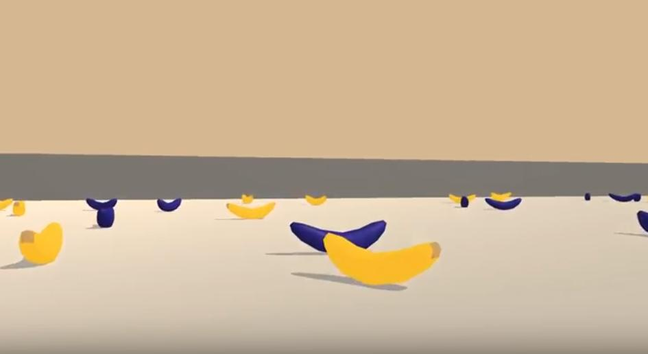
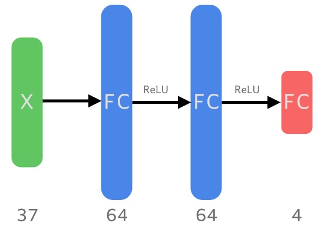
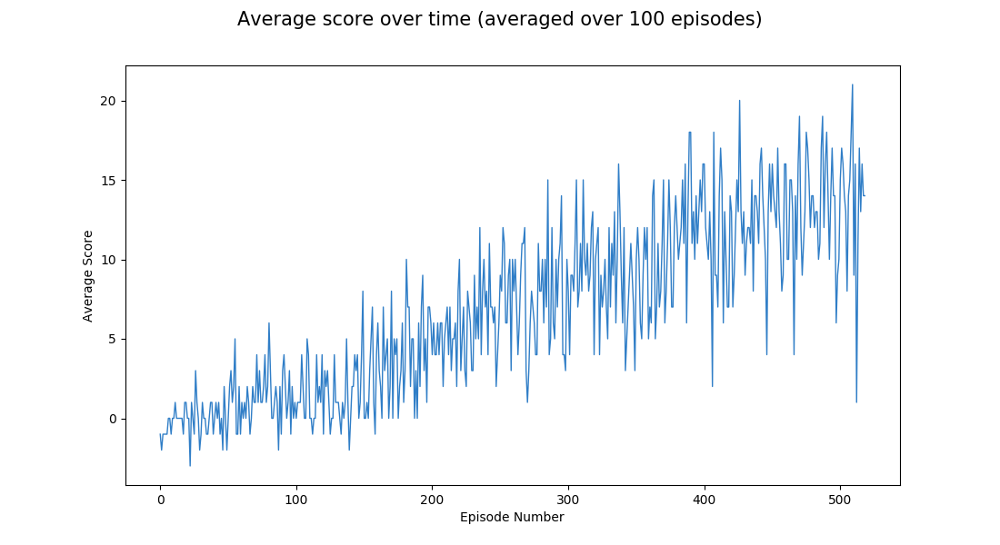

# Deep Q-Learning on the Banana Environment

## Summary

The problem being solved in this project is creating an agent that can navigate a 3D environment to seek out certain items while avoiding other ones. Concretely, the environment contains randomly positioned bananas of two varieties. There are blue ones and yellow ones. The yellow bananas as healthy, and the aim is to pick up as many of them as possible. Conversely, the blue bananas are not healthy, and should be avoided.

Below is sample image of what the environment looks like.

The agent starts out with no prior knowledge of the environment, what its goal is, what its actions are, or what effect those actions have in the environment. Through rewards and punishments, the agent has to learn over time to navigate the 3D environment, avoid the poisonous bananas and seek out the healthy bananas.

An agent was implemented that solves this task, using the Deep Q-learning algorithm.

## Environment Description

The environment provides the agent with information about the state in the form of a vector with 37 elements. This vector contains information about things like the velocit of the agent, as well as information about obstacles in the agent's forward direction using ray based perception.

The actions available to th agent are as follows;

- 0: forward
- 1: backward
- 2: left
- 3: right

It receives a reward of  `+1` for collecting a yellow banana, and `-1` for collecting a blue banana. The goal of the agent is therefore to collect as many yellow bananas as possible within each episode, while avoiding the blue ones. The problem is considered solved if it gets an average score of 13 over a rolling window of 100 consecutice episodes of game play.

## Agent

A [deep Q-learning model](https://storage.googleapis.com/deepmind-media/dqn/DQNNaturePaper.pdf) is used to learn appropriate representations that map the input states to actions the agent should take in order to maximize its reward.

The structure of the neural network used is as follows:

There are two hidden fully connected layers, each with 64 neurons, and using a [ReLu](http://proceedings.mlr.press/v15/glorot11a/glorot11a.pdf) activation function. This is followed by a final fully connected layer that outputs the values for each action.

An epsilon greedy policy is used to allow the agent to explore random actions. It starts out exploring random actions with a probability of 1 for the first episode. That value gets decayed at a rate of 0.995 after each subsequent episode, until it reaches a minimum value of 0.01. Having the value capped at a small, but non-zero value means that the agent will always continue to explore new actions once every so often.

## Results

The agent was able to solve this problem within 419 episodes of gameplay. A plot of the average scores over windows of 100 training episodes can be viewed below:

Below is a video of the trained agent interacting with the world.

https://www.youtube.com/embed/cSQVqcWtz2o

## Future Improvements

There have been several improvements to the original [Deep Q-Learning algorithm](https://storage.googleapis.com/deepmind-media/dqn/DQNNaturePaper.pdf) which could make the agent learn even more quickly. Some of them are the Dueling DQN, Double DQN, Prioritized Experience Replay, and Rainbow Network. Experimenting with these networks will likely yield improved performance.

The current version of the environment makes use of state information in the form of a vector that is provided by the environment. An even more challenging task is to interpret the state of the environment from visual input of the environment alone. This is a task worth attempting.
